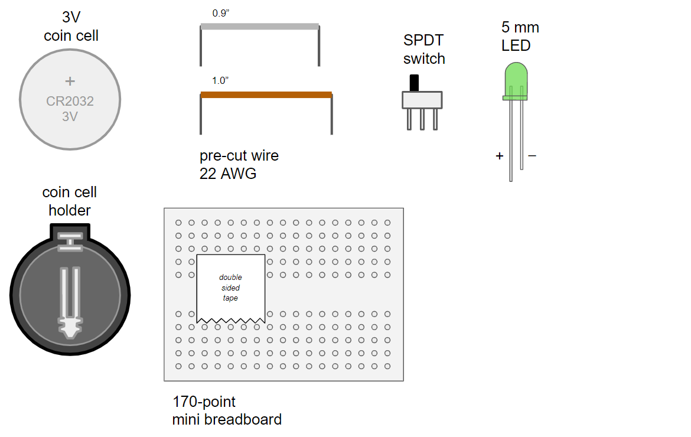
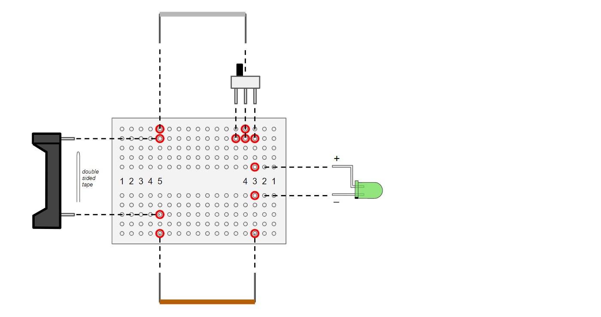
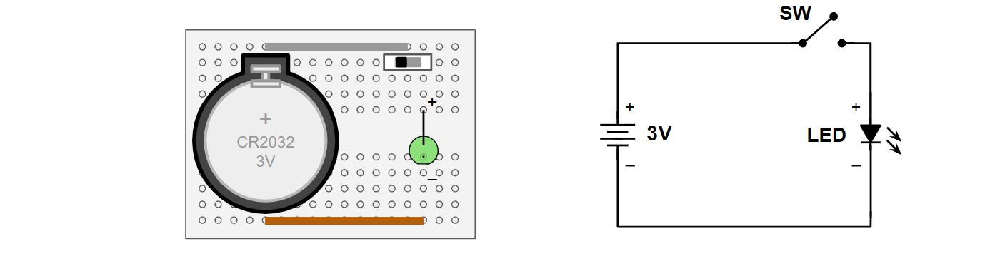
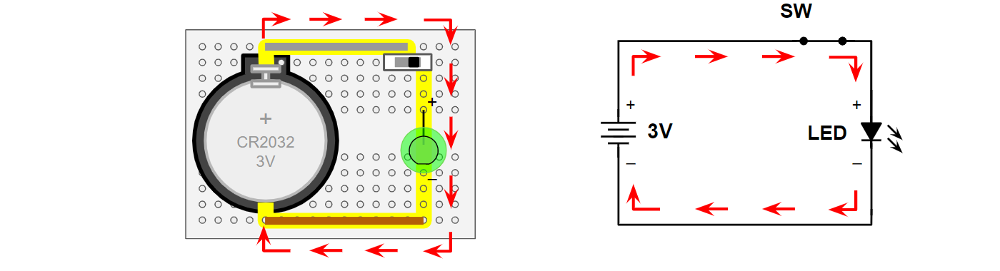

## One LED on Mini Breadboard

This is a quick educational project than can be an introduction to electronics.

<table style="border:none;">
  
<tr style="border:none;"><td width=20% valign=top">
PARTS 
- CR2032 coin cell  
- coin cell holder  
- 0.9" wire  
- 1.0" wire  
- SWDT switch  
- 5mm LED  
</td><td>

 
</td></tr>

<tr style="border:none;><td width=20% valign=top>
STEP 1 Assemble parts on the mini breadboard
</td><td>

 
</td></tr>

<tr style="border:none;><td width=20% valign=top>
STEP 2 Complete the one LED circuit
</td><td>

 
</td></tr>

<tr style="border:none;><td width=20% valign=top>
STEP 3 Turn switch on to test
</td><td>

 
</td></tr>

</table>

# How to build this

Obtain the necessary parts and build as shown above.

# How to teach this 

If you would like to teach this, it is possible to buy all the parts in quantity and achieve a cost of $1 USD per student. 
