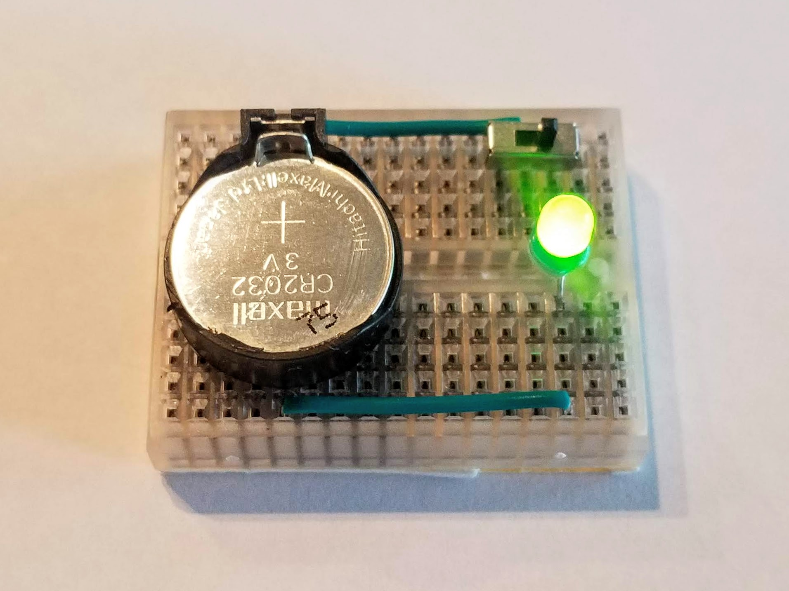
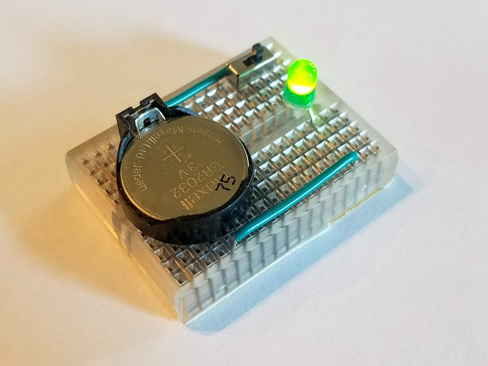

# OneLedBB: One LED on Mini Breadboard

This is a quick educational project than can be an introduction to electronics. This project only takes a few minutes to assemble. It's also a good, quick project for a large group activity.

<table>
<tr><td width="25%" style="border:none;" valign="middle">

<b>PARTS</b> 
 
- CR2032 coin cell  
- coin cell holder  
- double-side tape  
- 0.9&quot; wire  
- 1.0&quot; wire  
- SWDT switch  
- 5mm LED  
 
<b>Note:</b> 22 AWG solid code works best for breadboards

</td><td style="border:none;" valign="middle">

 
 
 
  
</td></tr>
<tr><td width="25%" style="border:none;" valign="middle">

<b>STEP 1</b> 
 
Assemble parts on the mini breadboard 
 
<b>Note:</b> Insert parts as indicated by the column numbers in the diagram

</td><td style="border:none;" valign="middle">

 
 
 

</td></tr>
<tr><td width="25%" style="border:none;" valign="middle">

<b>STEP 2</b> 
 
Add CR2032 coin cell to complete the one LED circuit 
 
<b>Note:</b> Make sure positive (+) side of coin cell faces up

</td><td style="border:none;" valign="middle">

 
 
 

</td></tr>
<tr><td width="25%" style="border:none;" valign="middle">

<b>STEP 3</b> 
 
Turn switch on to test 

<b>Electric current will flow in direction of the red arrows</b>

</td><td style="border:none;" valign="middle">

 
 
 
  
</td></tr>
</table>

## How to Build

Obtain the parts and build as shown above. Note that a current limiting resistor is not needed for the LED in this configuration. The reason is that CR2032 coin cell batteries have internal resistance and have a voltage that is close to the LED's forward voltage. (With other types of batteries or power sources, a current limiting resistor is required for an LED.)

The parts can be purchased on sites such as Amazon.com. Search for "2032 coin cell", "2032 coin cell holder", "170 point breadboard", "mini SPDT switch SS12D00G3" and "5mm LED". Some points to take into account: (1) coin cell holder should not have a strong clip that will make it difficult to insert remove the coin cell, (2) SPDT switch should only have three pins and no other protrusions, and the pins should be 0.1" apart, (3) LED can generally be any color 5mm LED.

If you build this with children, mind the coin cell holder pins and the LED pins. The coin cell holder should be glued or securely attached to the breadboard with double-sided tape. The mini breadboards have adhesive on the bottom, and they can, for example, be attached to LEGO plates.

## How to Teach this Project

If you would like to teach this, you can use this set of <a href="https://bit.ly/2YEv6Cs">OneLedBB instructional slides</a> as you explain how to build and how electric current flows. You are welcome to copy and adapt these slides.

If you will be teaching this project to a large number of students, you will find that by buying all the parts in larger packages will result in the cost per student on the order of $1 to $2 USD. It's also useful to give small zip-lock bags so that students can take their circuits home and not lose any parts.

When buying the parts needed, it's possible to buy pre-cut wires in bulk. Buying the pre-cut wires makes preparation for a large number of students easy. Go to the <a href="https://www.digikey.com/">Digi-Key Electronics</a> and search for "3M jumper wire". The bulk wire packages for this project are: <a href="https://www.digikey.com/product-detail/en/3m/923345-09-C/923345-09-ND/12206">3M JUMPER PREFORM 0.9" 22AWG 150PCS 923345-09-ND</a>, <a href="https://www.digikey.com/product-detail/en/3m/923345-10-C/923345-10-ND/12207">3M JUMPER PREFORM 1" 22AWG 100PCS 923345-10-ND</a>.

## Photos

<table style="border:none;margin:0px;padding:0px;"><tr style="border:none;margin:0px;padding:0px;vertical-align:top;"><td style="border:none;margin:0px;padding:0px;vertical-align:top;">

 

</td><td style="border:none;margin:0px;padding:0px;" width=20px></td><td style="border:none;margin:0px;padding:0px;vertical-align:top;">

 

</td></tr></table>
